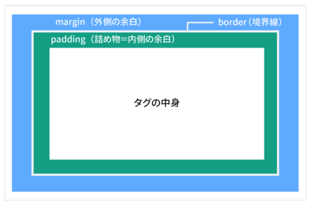

# CSS_01

## CSS記述
- HTML内直接記述
  ```
  <style>
    body {
      background-color: lightblue;
    }
  </style>
  ```

- ファイル分け
  ```
  <link rel="stylesheet" href="self-introduction.css" />
  ```

## 記法
### 基本
```
セレクタ{
    プロパティ:値;
    プロパティ:値;
}
```
- セレクタは要素、クラス、idを指定可能
  - 要素の指定：aタグの場合：`a { プロパティ : 値; }`
  - id（`#`）の指定：idがtestの場合：`#test { プロパティ : 値; }`
  - class（`.`）の指定：classがtestの場合：`.test { プロパティ : 値; }`

- devツールの選択機能でCSSを調べることが可能
- 16進数カラーコード：RGBのそれぞれの強さを16進数で表している
  - 光の三原色：RGB
    - 黒：#000000
    - 白：#FFFFFF
    - 赤：#FF0000
    - 緑：#00FF00
    - 青：#0000FF
    - 黄色：#FFFF00
<br><br>
- margin：対象の外側の余白
- padding：対象の内側の余白

    


### JSからCSS操作
- idから要素を取得してCSS（style）に文字列を書き加える
  ```
  let header = document.getElementById('header');
  header.style.transform = 'rotateX(60deg)';
  ```

- classは配列に格納される
  ```
  // クラス'c1'の色を全て変更する
  function changeBackColor(){
    var elements = document.getElementsByClassName('c1');
    for(i=0;i<elements.length;i++){
      elements[i].style.color = "green";
    }
  }
  ```