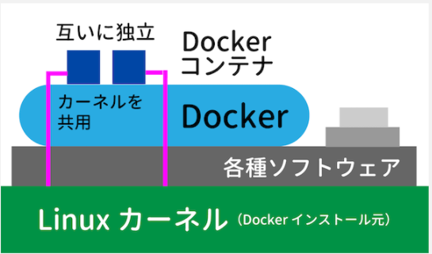
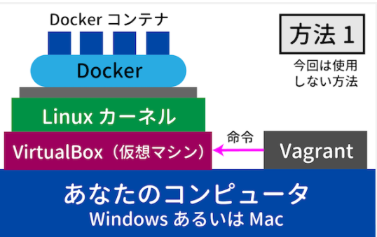
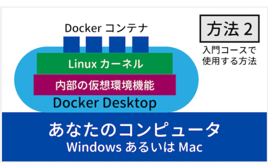
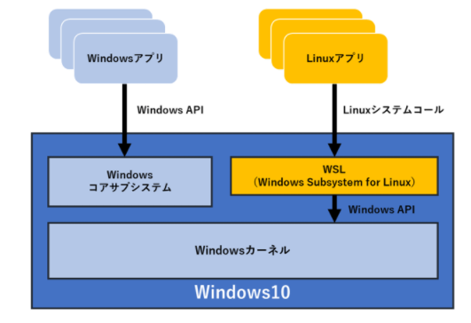
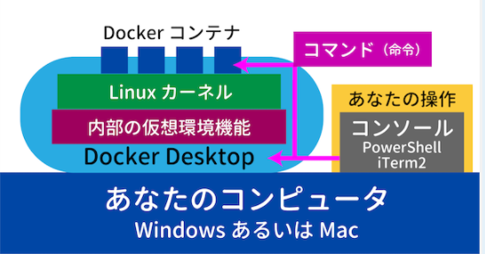
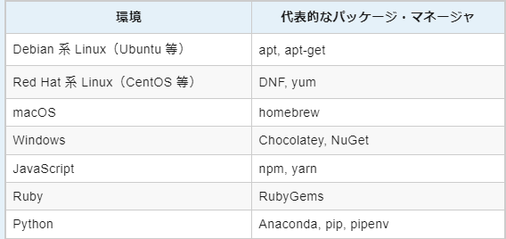

# Linux_01

## LinuxとOS
- LinuxはLinuxカーネルのことを指す（狭義のLinux）
  - Linuxディストリビューション：Linuxカーネルと様々なソフトウェアを組み合わせてパッケージ化（広義のLinux）
    - Debian系：Debian GNU/Linux,Ubuntu
    - Red Hat系：Red Hat Enterprise Linux,CentOS
    - Slackware系：Slackware
  - GNU General Public License（GPL）というライセンス下で提供
    - プログラムを実行する自由
    - ソースの改変の自由
    - 利用・再配布の自由
    - 改良したプログラムをリリースする権利
- カーネル：OSの中核のみを担当（車でいうエンジン）
- プログラミング＝サーバー上で動くアプリを開発→手元にもサーバーと同じ環境を構築（Linux）し開発・検証
- CLI(CUI)
  - 自動化しやすい

## VM
- VMを構築するソフトウェア：VirtualBox、VMware

## コンテナとDocker
- `コンテナ`：OS 上に論理的な区切り（コンテナ）を作り、それぞれを独立したコンピューターのように使う仕組み
  - 一つのコンピュータに独立した環境を構築可能（互いに干渉しない）
  - DockerではDockerがインストールされている元のLinuxカーネルを共用する
    - カーネルは共用しているものの、カーネルより上層のソフトウェアとファイルシステムは独立
      - ->各 Docker コンテナは独立した Linux コンピューターとみなすことができる

- `Docker`：Linux上でコンテナを実現するソフトウェア、DockerはLinux上で動作


- Dockerの構築
  - VM内にDoker
    - VMのLinux上（VirtualBoxなどで構築）に手動でDockerをインストール
    - 

  - Docker Desktop
    - Docker Desktop内部には、WindowsやmacOS上にLinuxカーネルの仮想環境を構築する機能が含まれている
    - 

- Dokerfile：設定ファイル（作業ディレクトリに置く？）
- docker-compose.yml
- Dockerイメージ：Dockerコンテナの実行に必要なファイル群
- Docker Compose：Dockerコンテナ起動のためのツール

- WSLとは
  - Windows OS上でLinuxの実行環境を実現するサブシステム。Linuxのプログラムからのシステムコール（APIやファイルアクセス要求など）をWindows APIに変換して、Linuxのバイナリ・プログラムを実行します。

  - 従来、PCにLinuxを実装すると、そのPCはLinux専用マシンになってしまい、Linux環境で作業をしながらWindows環境を利用したい場合は、別のPCが必要でした。WSLでは1台のPCでLinux環境とWindows環境を共有することができます。
   

- ホストOSからはDockerコンテナは一つのプロセスとして扱われる
- コンソールからDocker Desktopのソフトウェアを操作しているイメージ

   

## dockerとコマンド

- プロンプト：コンソール上の1 行の最後が > や % や $ で終わっている部分
- `~\`：自分（User）下を示す
- `.`：カレントディレクトリ

  ```
  cd ~\workspace\linux-study
  ```

- docker起動
  ```
  docker-compose up -d //-dオプションで起動後プロンプトに入力可能
  ```

- コンテナの中のコンソールに入る（コマンド実行）
  ```
  docker-compose exec コンテナ（サービス）名 コマンド
  ```

- カレントディレクトリにコンテナ（プロセス）一覧
  ```
  docker-compose ps -a //-aで一覧表示
  ```

- コンテナの終了・破棄
  ```
  docker-compose down
  ```

## パッケージマネージャについて
- ソフトウェアを管理するためのソフトウェア
- iPhoneでいうAppStoreみたいなイメージ

   


コンテナを破棄（down）するとDockerコンテナ上のデータは失われる（インストールしたパッケージなど）
→Dockerコンテナ上のディレクトリがホストOSのディレクトリにマウントされていないため
→毎回起動した場合はDockerファイルに以下を追記する
```
RUN apt-get install bsdgames
```

マウント：ファイル共有
