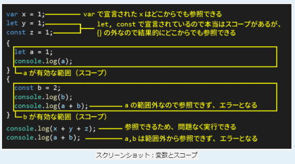

input_type：size→40：40文字分入る（アルファベット換算）
日本語入力の場合はmaxlengthの倍とる

HTMLでは、scriptは最後に記述する
JSからHTMLのid属性を操作する場合、先に読み込んでしまうとHTMLのid属性を認識できずにエラーになる
上から読み込むため

利用者が直接触れる部分：ユーザーインターフェース（UI）

光の三原色：RGB
１６進数カラーコード：RGBのそれぞれの強さを１６進数で表している

黒：#000000
白：#FFFFFF
赤：#FF0000
緑:#00FF00
青：#0000FF
黄色：#FFFF00

margin：対象の外側の余白
padding：対象の内側の余白


css
id：#
class：.

vscode tips :　マルチカーソル
ctrl + shift + ↓ or alt + shift + ドラッグ
command + option ↓

End
command + →
最後尾（右端）にカーソルを移動

"use strict"; 厳格モード

まずは const の使用を検討します。
変数の値を変更する必要がある場合のみ、let を使用します。

const：１度しか代入できない変数（定数）
let：｛｝内で宣言するとスコープは｛｝内、{}外で宣言するとどこでも参照可能
var：どこからでも参照可能、{}の外でも使える（基本使わない）

配列：array



"{変数}"

JS DOCコメント：関数の説明
１行目関数の処理内容を説明
２行目@param→parameter：引数 userName：引数の名前：入力
３行目@return→return value：戻り値：出力
{string}：値の型が文字列（string）型であることを示す（他 数値、真偽値）
入出力：インターフェース、JSは型を記述しないのでコメントで明記しておくことが推奨される

vscodeでは、/**と入力してtabを押下するとテンプレ表示

/**
 * 名前から診断結果を返す関数
 * @param {string} userName 名前
 * @returns {string} 診断結果
 */

 sumOfCharCode=sumOfCharCode+userName.charCodeAt(i);
 左の変数に代入していく（sumOfCharCode）
 右のsumOfCharCodeは前回のsumOfCharcodeの値というイメージ

 returnは複数の値を返すことができない
 →配列に入れて、配列を返して、取り出す

 関数名(引数)
 eg. replaceAll()

 スプレッド構文

 無名関数：そこだけで使う使い捨ての関数みたいなイメージ
 ```
 function () {

 }
 ```
 アロー関数
 ```
 () => {

 }
 ```

 console.assert＝テストできる

cssも上から読まれる

class属性は複数設定することが可能
class="classA classB classC"
classList.add